

# _**Ref Report**_

 

    

## _**About**_

This website was designed as a tool for use by Amateur referees. My son is keen to become a referee, 
and we found that other than writing the details in a notebook which are prone to being lost or misplaced,
there was nothing else of use to him to keep a record of the match details. I wanted to design a tool to help
him and other referrees to make a record of the game they have just taken charge of as soon as they get back
to the dressing room.  
Users are able to register a new account, login to their account where they can submit a new report, view all 
existing reports and also edit and delete reports as necessary.  

The deployed website can be viewed here - [Ref Report](https://adamp-ref-report.herokuapp.com/)

## _**UX**_ 

The site was designed to be easy and straight forward to use. I created a simple homepage with a small
amount of information about how the site works, and also a link for new users to register an account.  
The website is easy to navigate by either using the menu links in the header, or using the side navigation bar on smaller
devices.  
I designed the site to have a consistent look to each page, the forms are the same throughout whether logging in or 
submitting a report, and each page has a familiar feel to it.

### _**Target Audience**_ 

The website is aimed at but not restricted to the following users :

* Young amateur referees.
* Senior amateur referees.
* Referee assessors.
* Football coaches who wish to keep a record of their matches.
* Football fans to keep a track of their favourite team.

### _**User Stories**_

1. As a referee, I want to register for an account, so that I can begin to submit my match reports.

2. As a referee, I want to login to my account, so that I can view and submit reports.

3. As a referee, I want to submit a report on a match I have just referee'd, so that I can store the details as they are fresh 
in my mind.

4. As a referee, I want to view my previous submitted reports, so they can help me submit the match details to the league.

5. As a referee, I want to edit my reports, so I can change any details that may be incorrect.

6. As a referee, I want to delete my reports, so I can only keep the reports that haven't been submitted to the league.

7. As an administrator, I want to view all users reports, so I can moderate what has been submitted.

8. As a football coach, I want to store match reports of the team I coach, so I can keep a track of the team throughout the season.

9. As a football fan, I want a place to keep a record of my favourite team, so I can look back at how they have played over the season.

10. As a user, I want to be notified if my login information is incorrect, so I can input the correct details and log in to my account.

## _**Wireframes**_

### _**Home Page**_
 

    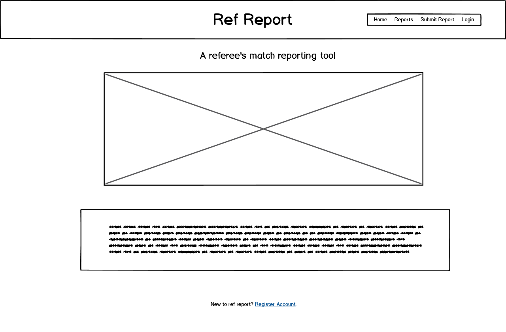

 

### _**Registration Page**_
 

    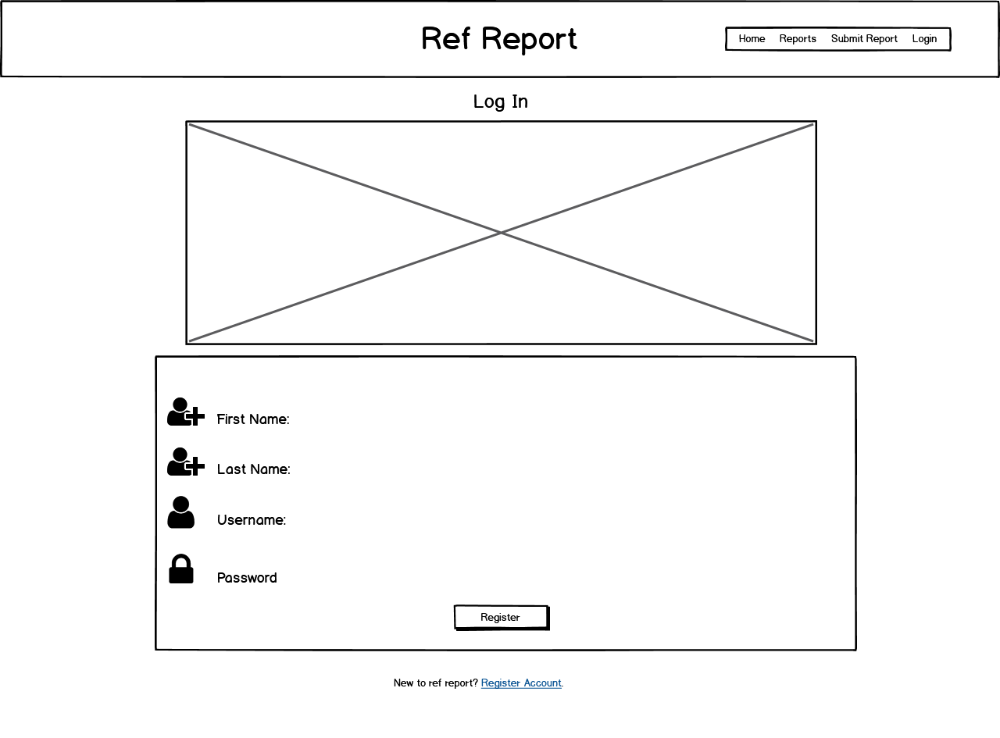

 

### _**Login Page**_
 

    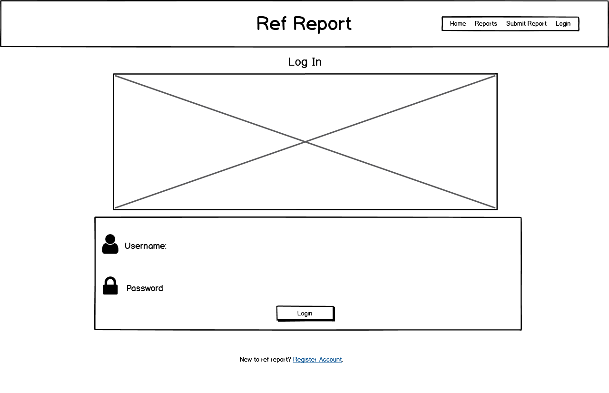

 

### _**Reports Page**_
 

    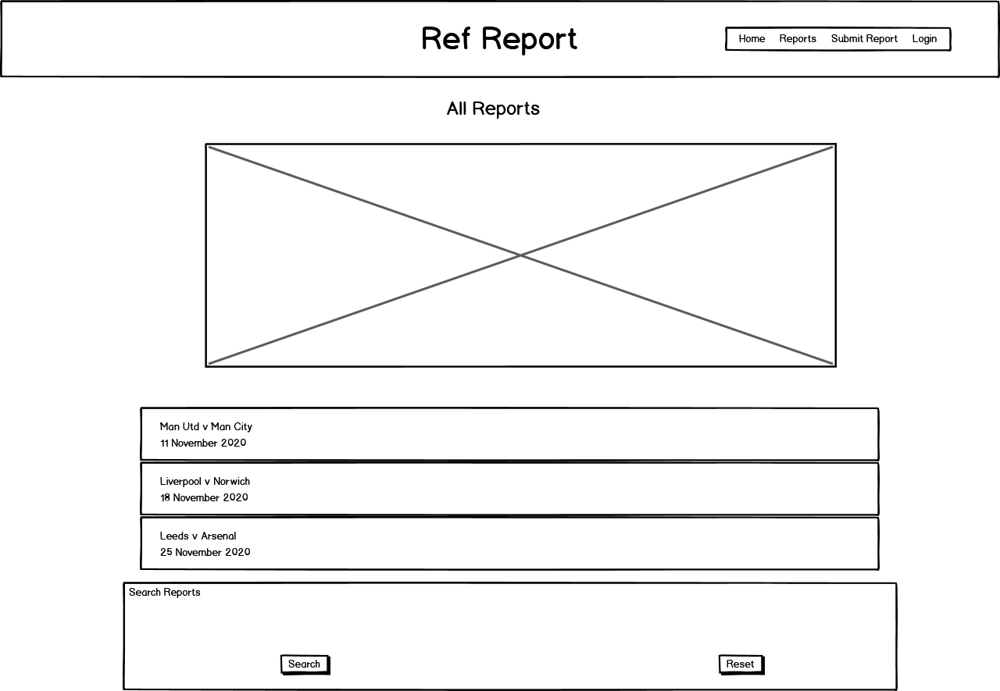

 

### _**Submit Report Page**_
 

    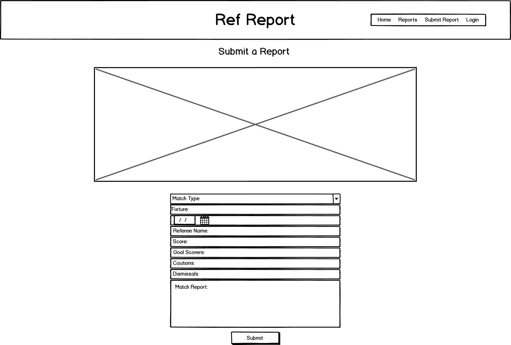

 

### _**Tablet View**_
 

  

 

### _**Smartphone View**_
 

  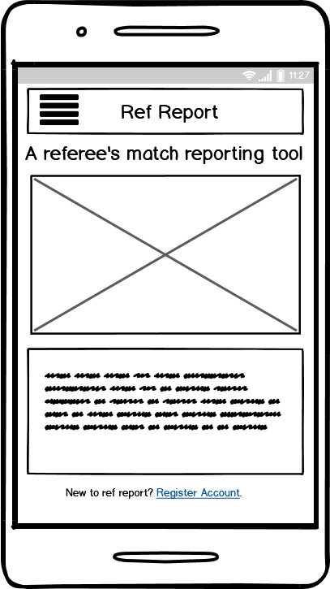

 

## _**Features**_

* **Navigation Bar** - The navigation bar is consistent across the site, it uses [Materialize CSS](https://materializecss.com/) to make it beahave responsively 
on smaller devices.

* **Side Navigation Bar** - When viewed on smaller devices the links in the navigation bar, appear from the left when the 
hamburger menu is pressed.

* **Modal Pop Up** - The links to the log in and registration page utilise a modal pop up when viewed on smaller devices.

* **Collapsible Accordion** - The reports page utilises a collapsible from [Materialize CSS](https://materializecss.com/) when viewing the reports.

* **Submit Report** - Allows users to submit a match report to the database.

* **View Report** - Users can view a list of their reports and expand them to diaplay all of the details.

* **Edit / Delete Buttons** - Users have the option to edit or delete any of their reports.

### _**Features left to implement**_

## _**Technologies Used**_

[HTML](https://en.wikipedia.org/wiki/HTML5) - Provides the content and structure of the templates.

[CSS](https://en.wikipedia.org/wiki/Cascading_Style_Sheets) - Used to provide some of the styling.

[Materialize CSS](https://materializecss.com/) - Used to create a number of the html elements such as the forms, the collapsible and the pop up modal. It was also used to make the website responsive. 

[Python](https://www.python.org/) - Used to code the flask application.

[Flask](https://flask.palletsprojects.com/en/1.1.x/) - A micro web framework used to create the application.

[Werkzeug Security](https://werkzeug.palletsprojects.com/en/1.0.x/utils/) - Used for the users password security.

[Jinja](https://jinja.palletsprojects.com/en/2.11.x/) - Used as a templating language with flask and python

[MongoDB](https://www.mongodb.com/) - Used to create the databases and store the users data.

[jQuery](https://jquery.com/) - Used with Materialize CSS to enable the collapsible accordion, and modal pop up.

[Google Fonts](https://fonts.google.com/) - The website utilises the Lato font.

[Font Awesome](https://fontawesome.com/) - Used for the icons throughout the website.

[Git](www.github.com) - Used for version control, and tracking changes in the repository.

[Heroku](https://www.heroku.com/) - The platform used to deploy the website.

## _**Testing**_

A lot of the testing was carried out using the developer tools in Google Chrome, I did this so that I could test whilst I was devloping the website
and make changes as I went along. It also helped me test the website on smaller devices and to ensure it was responsive. 
I also used tools such as [W3C Markup Validation Service](https://validator.w3.org/) to ensure my code was correct and had no errors.

The user story test can be found here - [Testing.MD](static/files/TESTING.MD)

## _**Deployment**_

I developed Ref report using Gitpod, GitHub is used to store the repository, and the application is deployed on Heroku.

The following steps are taken to deploy the application.

### _**Git Clone**_

1. Navigate to my GitHub repository - <https://github.com/adamparker75/Ref_Report>
2. Click the dropdown that says code. 

  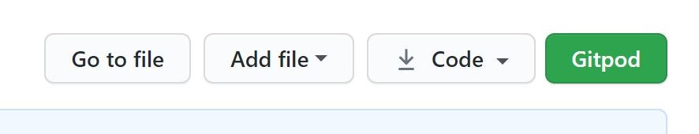

 

3. To clone with HTTPS copy the URL in the box.  

  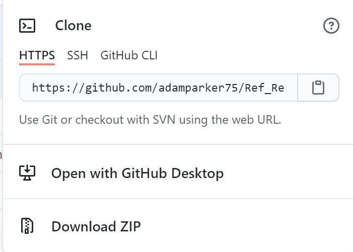

 

4. Open up your preferred IDE (Integrated Development Environment)
5. Change the directory to the location you want the clone to be made.
6. Type **git clone** and then paste the copied URL from step 3.
7. Press Enter and your local clone will be created.
8. In your IDE create an **env.py** file. The file should contain the following.

  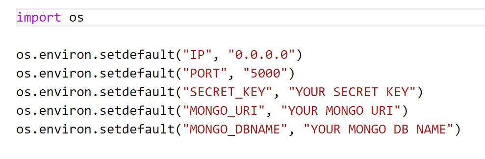

 

* Make sure to add in your own **Secret Key, Mongo URI and Mongo DB name**.
* You should also add the **env.py** file to **.gitignore**. 

### _**Deploying to Heroku**_

1. In your IDE create a **requirements.txt** file by typing the following.  
**pip3 freeze --local > requirements.txt**
2. Next create a **Procfile** by typing the following.  
**echo web: python app.py > Procfile**
3. Open up the Procfile and if there is a blank line at the top of the file delete it.
4. Commit and push the files to Github.
5. Navigate to Heroku and login - <https://id.heroku.com/login>
6. Click on the new button and then choose create new app.

  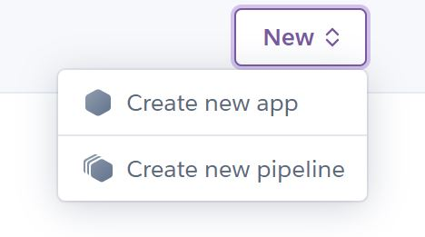

 

7. Give the app a name, choose a region, and then click create app.

  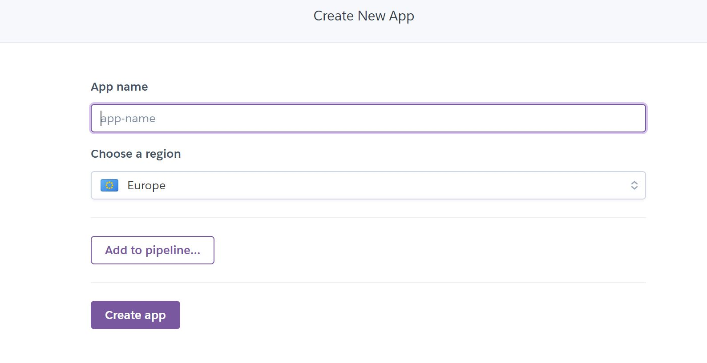

8. Click connect to GitHub and then search for the repository name. Once found, click connect.

  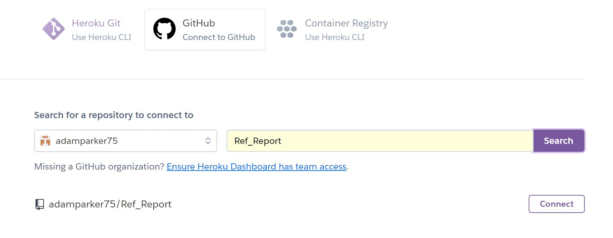

8. Click the settings tab in your Heroku app and then click reveal config vars.

  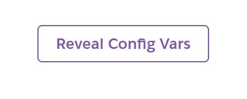

9. Add in the same variables as the **env.py** file.

  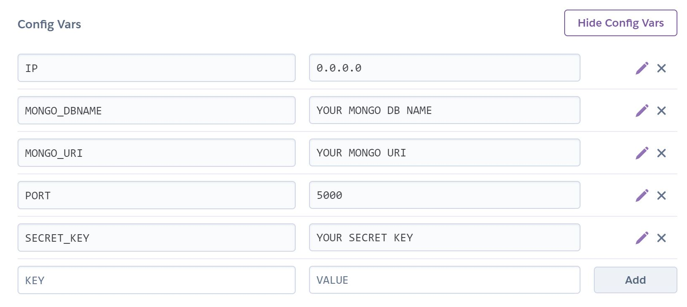

10. Click back to the deploy tab, choose a branch to deploy and then click enable automatic deploys.

  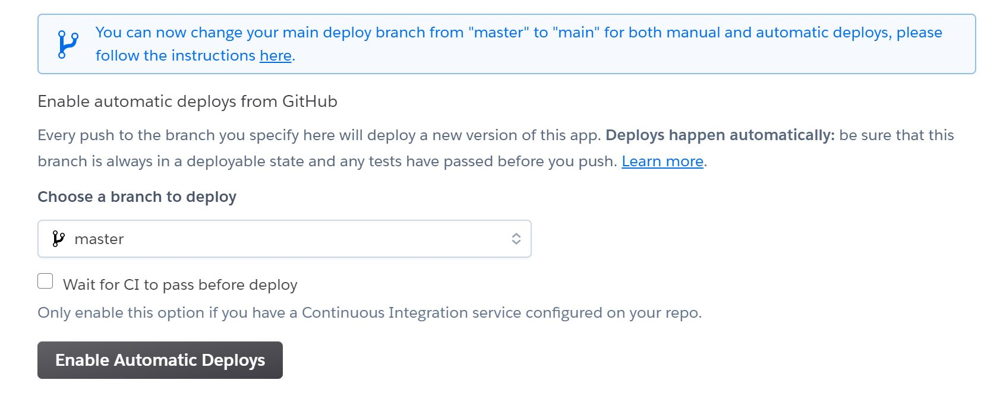

11. Click open app at the top of the page.

  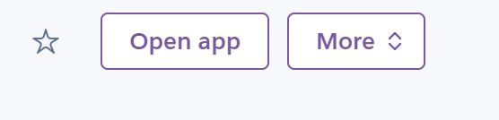

